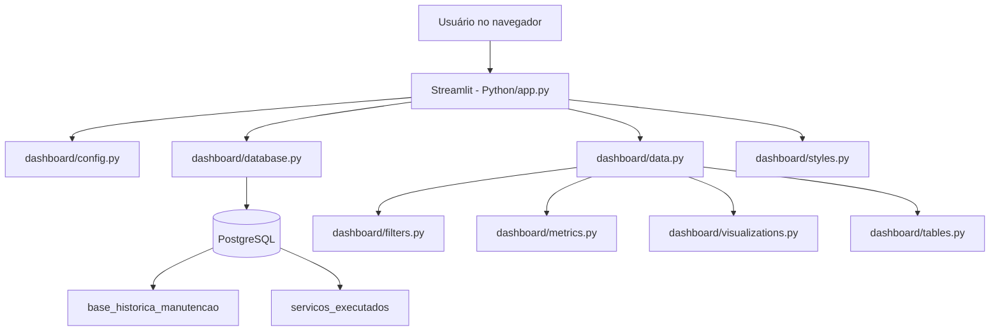
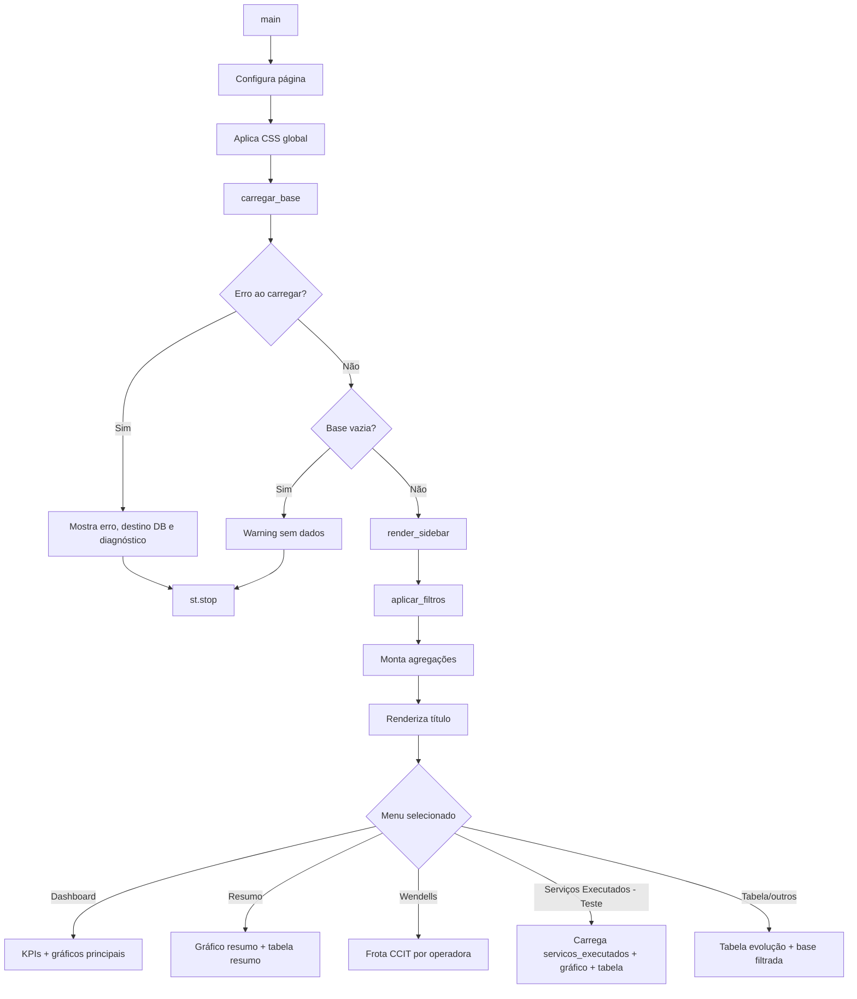
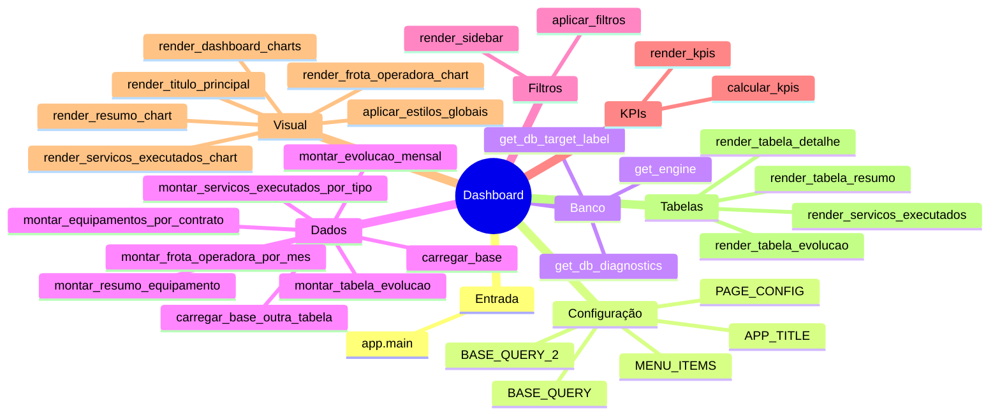

# Guia passo a passo do código — Dashboard de Manutenção e Serviços Executados

> Documento revisado a partir da leitura dos arquivos atuais do repositório. Ele serve como material de onboarding para entender o projeto, executar localmente, localizar cada responsabilidade no código e saber onde alterar cada parte.

---

## 1. Resumo executivo

Este repositório contém uma aplicação **Streamlit** com gráficos **Plotly** e dados vindos de um **PostgreSQL**. A aplicação principal fica em `Python/app.py` e usa módulos dentro de `Python/dashboard/` para separar responsabilidades.

Na prática, o dashboard trabalha com duas bases principais:

1. `base_historica_manutencao`: base usada no dashboard principal, resumo, tabela e visão “Wendells”.
2. `servicos_executados`: base usada na página “Serviços Executados - Teste”.

O banco é provisionado localmente pelo Docker Compose com PostgreSQL 16 e pgAdmin. O arquivo `app_db_utf8.sql` é carregado automaticamente na primeira criação do volume do Postgres.

---

## 2. Estrutura real do repositório

```text
.
├── Docker/
│   ├── Dockerfile
│   └── docker-compose.yml
├── Importacoes/
│   ├── Basehistorica.csv
│   ├── bsa_serv_exce.csv
│   ├── historico_serv_exec_7700.csv
│   ├── importa_servicos_executados.py
│   └── importacao_historico_manutencao.py
├── Python/
│   ├── app.py
│   ├── requirements.txt
│   └── dashboard/
│       ├── __init__.py
│       ├── config.py
│       ├── data.py
│       ├── database.py
│       ├── filters.py
│       ├── metrics.py
│       ├── styles.py
│       ├── tables.py
│       └── visualizations.py
├── app_db.sql
├── app_db_utf8.sql
├── DOCUMENTACAO_TECNICA.md
├── GUIA_PASSO_A_PASSO_CODIGO.md
├── Postgres Local.session.sql
└── README
```

### Observações importantes da leitura do repositório

- O `README` ainda descreve o projeto com foco maior na tabela `servicos_executados`, mas o código atual do `app.py` começa pela tabela `base_historica_manutencao`.
- O arquivo `DOCUMENTACAO_TECNICA.md` parece estar desatualizado em alguns pontos, pois menciona views como fonte principal, enquanto o código atual lê diretamente as tabelas via `BASE_QUERY` e `BASE_QUERY_2`.
- O `Dockerfile` possui a linha de instalação das dependências comentada (`RUN pip install ...`). Se a imagem base não tiver os pacotes, o container da aplicação pode falhar ao iniciar.
- O `app_db.sql` aparece com caracteres nulos/encoding inadequado na visualização do terminal; o arquivo operacional recomendado no Compose é `app_db_utf8.sql`.

---

## 3. Diagrama geral da arquitetura



### Leitura do diagrama

1. O usuário acessa o Streamlit no navegador.
2. `Python/app.py` inicia a tela.
3. `database.py` monta a conexão com PostgreSQL.
4. `data.py` carrega e prepara os dados.
5. `filters.py` renderiza filtros e aplica recortes.
6. `metrics.py`, `visualizations.py` e `tables.py` exibem KPIs, gráficos e tabelas.
7. `styles.py` aplica CSS customizado.

---

## 4. Fluxo completo da aplicação (`Python/app.py`)



### Passo a passo do `main()`

1. Define configurações da página com `PAGE_CONFIG`.
2. Injeta CSS global para alterar aparência do Streamlit.
3. Carrega `df_base` chamando `carregar_base()`.
4. Se houver erro de conexão ou SQL:
   - mostra `st.error`;
   - mostra o destino de banco detectado;
   - mostra diagnóstico de secrets/env;
   - encerra com `st.stop()`.
5. Se `df_base` estiver vazio, exibe aviso e encerra.
6. Cria os filtros laterais com `render_sidebar(df_base)`.
7. Aplica filtros com `aplicar_filtros(df_base, filtros)`.
8. Monta DataFrames derivados para gráficos e tabelas.
9. Mostra o título principal.
10. Escolhe o conteúdo conforme o menu selecionado.

---

## 5. Configurações fixas (`Python/dashboard/config.py`)

### 5.1 Configuração da página

`PAGE_CONFIG` controla:

- título da aba do navegador;
- ícone;
- layout `wide`;
- sidebar inicialmente expandida.

### 5.2 Título e menu

`APP_TITLE` define o título visual da página: `Dashboard de Manutencao das Filiais`.

`MENU_ITEMS` define as páginas disponíveis:

1. `Dashboard`
2. `Resumo`
3. `Tabela`
4. `Wendells`
5. `Serviços Executados - Teste`

### 5.3 Configuração padrão do banco

`DB_SETTINGS` contém fallback local:

```text
usuario: app_user
senha: app123
host: localhost
porta: 5432
banco: app_db
```

> Atenção: esses valores são fallback. Em ambiente cloud ou produção, prefira variáveis de ambiente ou secrets.

### 5.4 Queries principais

`BASE_QUERY` lê a tabela `base_historica_manutencao` e já seleciona as colunas esperadas pelo dashboard.

`BASE_QUERY_2` lê a tabela `servicos_executados`, que possui colunas em maiúsculas e com aspas no PostgreSQL, renomeando-as com aliases para nomes mais amigáveis como `data_ref`, `contrato`, `equipamento`, `servico_executado` e `qtd_servico`.

---

## 6. Conexão com banco (`Python/dashboard/database.py`)

### 6.1 Prioridade de configuração

A conexão tenta encontrar configuração nesta ordem:

1. `DATABASE_URL` em `st.secrets` ou variável de ambiente.
2. Chaves separadas como `DB_HOST`, `DB_PORT`, `DB_NAME`, `DB_USER`, `DB_PASSWORD`.
3. Configurações aninhadas em `connections.postgresql.*` ou `connections.db.*`.
4. Fallback local definido em `DB_SETTINGS`.

### 6.2 Funções auxiliares

| Função | Responsabilidade |
|---|---|
| `_get_secret_value` | Busca valor dentro de `st.secrets`, inclusive com caminho aninhado. |
| `_first_non_empty` | Retorna o primeiro valor não vazio. |
| `_normalize_database_url` | Troca prefixo `postgres://` por `postgresql://`. |
| `_get_db_config` | Consolida a configuração final do banco. |
| `get_db_target_label` | Gera texto amigável `host:porta/banco` para diagnóstico. |
| `get_db_diagnostics` | Retorna flags booleanas indicando quais secrets/env existem. |
| `get_engine` | Cria o `Engine` SQLAlchemy com `pool_pre_ping=True`. |

### 6.3 Por que `pool_pre_ping=True` importa?

Essa opção faz o SQLAlchemy testar a conexão antes de reutilizá-la. Isso reduz erros quando uma conexão antiga do pool foi encerrada pelo banco.

---

## 7. Carregamento e transformação dos dados (`Python/dashboard/data.py`)

## 7.1 `carregar_base()`

### O que faz

Lê `BASE_QUERY` no PostgreSQL e normaliza tipos para uso no dashboard.

### Passos internos

1. Executa `pd.read_sql(BASE_QUERY, get_engine())`.
2. Se o DataFrame estiver vazio, retorna imediatamente.
3. Converte `data_ref` para datetime.
4. Converte `qtd`, `frota` e `percentual` para numérico.
5. Preenche nulos numéricos com zero.
6. Normaliza textos (`id_contrato`, `contrato`, `id_operadora`, `operadora`, `cod_equipamento`, `equipamento`) com `fillna`, `astype(str)` e `strip`.

### Saída esperada

Um DataFrame pronto para filtros e agregações de manutenção.

## 7.2 `carregar_base_outra_tabela()`

### O que faz

Lê `BASE_QUERY_2` para alimentar a tela “Serviços Executados - Teste”.

### Passos internos

1. Executa a consulta na tabela `servicos_executados`.
2. Retorna cedo se vier vazio.
3. Faz uma renomeação redundante/defensiva de `DATA` e `QTD_SERVICO`, embora a query já traga aliases.
4. Valida se `data_ref` e `qtd_servico` existem.
5. Converte `data_ref` para datetime e `qtd_servico` para número.

### Ponto de atenção

Essa base precisa ter colunas compatíveis com os filtros globais (`contrato`, `operadora`, `equipamento`, `data_ref`) porque a tela aplica `aplicar_filtros(df_servicos, filtros)` usando o mesmo dicionário de filtros da base principal.

---

## 8. Agregações analíticas (`Python/dashboard/data.py`)

## 8.1 `montar_resumo_equipamento(df_filtrado)`

Agrupa por equipamento e calcula:

- `total_qtd`: soma de `qtd`;
- `total_frota`: soma de `frota`;
- `media_percentual`: média de `percentual`;
- `percentual_recalculado`: `total_qtd / total_frota * 100`.

Se o DataFrame estiver vazio, retorna um DataFrame vazio com colunas esperadas.

## 8.2 `montar_evolucao_mensal(df_filtrado)`

Cria uma coluna `mes` a partir de `data_ref`, agrupa por mês e calcula totais mensais de `qtd`, `frota` e `% QTD x Frota`.

## 8.3 `montar_tabela_evolucao(df_filtrado)`

Parecida com a evolução mensal, mas agrupa por `mes` e `equipamento`. Ela alimenta a tabela de evolução e também o gráfico de frota por equipamento.

## 8.4 `montar_equipamentos_por_contrato(df_filtrado)`

Passos:

1. Remove contratos vazios.
2. Cria coluna `mes`.
3. Descobre o mês mais recente por contrato.
4. Mantém apenas os registros no mês mais recente de cada contrato.
5. Agrupa por contrato e mês.
6. Soma frota como `quantidade_equipamentos`.
7. Ordena decrescente e mantém top 10.

## 8.5 `montar_frota_operadora_por_mes(df_filtrado)`

Passos:

1. Remove operadoras vazias.
2. Mantém somente equipamentos cujo nome contém `CCIT`.
3. Cria coluna `mes`.
4. Seleciona o mês mais recente do recorte.
5. Agrupa frota por operadora.
6. Mantém top 6.
7. Cria `mes_label` em português abreviado, como `jan/26`.

## 8.6 `montar_servicos_executados_por_tipo(df_filtrado)`

Passos:

1. Remove serviços executados vazios.
2. Agrupa por `servico_executado`.
3. Soma `qtd_servico`.
4. Ordena do maior para o menor.
5. Converte a quantidade para inteiro.

---

## 9. Filtros e navegação (`Python/dashboard/filters.py`)

## 9.1 Constante de data padrão

`DATA_INICIO_PADRAO = date(2026, 1, 1)`.

Como a data atual do ambiente é 2026-06-18, o filtro padrão cobre inicialmente de **2026-01-01 até 2026-06-18**.

## 9.2 `render_sidebar(df_base)`

Renderiza a barra lateral com:

- seleção de página por rádio;
- filtro de período;
- multiselect de contrato;
- multiselect de operadora;
- multiselect de equipamento.

A função calcula limites mínimos e máximos para o componente de data com base nos dados disponíveis e na data atual.

## 9.3 `aplicar_filtros(df_base, filtros)`

Aplica os filtros na seguinte ordem:

1. período;
2. contrato;
3. operadora;
4. equipamento.

Todos os filtros são cumulativos, ou seja, funcionam como um `AND` lógico.

---

## 10. KPIs (`Python/dashboard/metrics.py`)

## 10.1 `calcular_kpis(df_resumo)`

Retorna um dicionário com:

| KPI | Cálculo |
|---|---|
| `media_entrada_manut` | média de `media_percentual` |
| `total_qtd` | soma de `total_qtd` |
| `total_frota` | soma de `total_frota` |
| `percentual_geral` | `total_qtd / total_frota * 100` |
| `mtbf_horas` | atualmente fixo como `N/D` |

Se não houver dados, retorna zeros e `N/D`.

## 10.2 `render_kpis(kpis)`

Cria 5 colunas no Streamlit e renderiza cards HTML:

1. Média Entrada em Manut.
2. MTBF (Horas)
3. Total QTD
4. Total Frota
5. % QTD x Frota

---

## 11. Estilos (`Python/dashboard/styles.py`)

## 11.1 `aplicar_estilos_globais()`

Injeta CSS para customizar:

- fundo do app;
- sidebar;
- header;
- espaçamento do container principal;
- título principal;
- cards de KPI;
- cards/seções.

## 11.2 `render_titulo_principal(titulo)`

Renderiza o título principal dentro de uma `div` estilizada com a classe `main-title`.

---

## 12. Tabelas (`Python/dashboard/tables.py`)

| Função | Tela/uso | Comportamento |
|---|---|---|
| `render_tabela_resumo` | Página Resumo | Ordena por `percentual_recalculado` desc. |
| `render_tabela_evolucao` | Página Tabela | Ordena por `mes` e `equipamento`. |
| `render_tabela_detalhe` | Página Tabela | Formata `data_ref` como `YYYY-MM-DD` e ordena desc. |
| `render_servicos_executados` | Serviços Executados - Teste | Formata `data_ref` e mostra dados filtrados. |

Todas usam `st.container(border=True)` e `st.dataframe(..., use_container_width=True, hide_index=True)`.

---

## 13. Gráficos (`Python/dashboard/visualizations.py`)

## 13.1 Paleta e helpers

O arquivo define uma paleta cinza/azulada e três helpers:

- `_cor_texto_tema()`: escolhe texto claro/escuro conforme tema.
- `_estilizar_figura(fig)`: aplica fundo transparente, margens, legenda e grade.
- `_mostrar_rotulos_barras(fig, template)`: coloca rótulos dentro das barras.

## 13.2 `render_dashboard_charts(...)`

Essa é a tela principal do menu `Dashboard`.

### Gráficos renderizados

1. `% QTD x FROTA` por mês.
2. `FROTA POR EQUIPAMENTO / MES`.
3. `SERVICOS EXECUTADOS` por mês.
4. `TOTAL PRINCIPAIS SERVICOS` por equipamento.
5. `EQUIPAMENTOS POR CONTRATO - MES MAIS RECENTE`.

### Ponto de atenção visual

O título do primeiro gráfico contém texto aparentemente acidental: `% QTD x FROTaaasdsada mudou??????A`. Isso não quebra a aplicação, mas deveria ser limpo em uma melhoria futura.

## 13.3 `render_resumo_chart(df_resumo)`

Mostra barras de `% QTD x Frota por Equipamento`. Também há texto aparentemente acidental no título: `wewedasdasd`.

## 13.4 `render_frota_operadora_chart(df_frota_operadora)`

Mostra frota CCIT por operadora no mês mais recente do recorte filtrado.

## 13.5 `render_servicos_executados_chart(df_servicos_resumo)`

Mostra ranking horizontal dos 20 principais serviços executados por tipo.

---

## 14. Banco de dados e modelo esperado

## 14.1 Tabela `base_historica_manutencao`

Colunas relevantes para a aplicação:

| Coluna | Uso no dashboard |
|---|---|
| `data_ref` | filtro de período e agrupamento mensal |
| `id_contrato` | identificação do contrato |
| `contrato` | filtro e agrupamento por contrato |
| `id_operadora` | identificação da operadora |
| `operadora` | filtro e gráfico da página Wendells |
| `cod_equipamento` | identificação do equipamento |
| `equipamento` | filtro e agrupamentos |
| `frota` | denominador/volume de frota |
| `qtd` | quantidade de serviços/manutenções |
| `percentual` | percentual original da base |

## 14.2 Tabela `servicos_executados`

No banco, a tabela usa nomes em maiúsculo e com aspas. A query converte para nomes usados pelo Python.

| Coluna no banco | Nome no DataFrame | Uso |
|---|---|---|
| `DATA` | `data_ref` | filtro de período |
| `ID_CONTRATO` | `id_contrato` | identificação |
| `CONTRATO` | `contrato` | filtro |
| `ID_EQUIPAMENTO` | `id_equipamento` | identificação |
| `EQUIPAMENTO` | `equipamento` | filtro |
| `ID_OPERADORA` | `id_operadora` | identificação |
| `OPERADORA` | `operadora` | filtro |
| `ID_SERVICO_EXECUTADO` | `id_servico_executado` | identificação |
| `SERVIC_EXECUTADO` | `servico_executado` | ranking de serviços |
| `QTD_SERVICO` | `qtd_servico` | soma de serviços |

## 14.3 Views existentes no dump

O dump `app_db_utf8.sql` também contém as views:

- `vw_dashboard_resumo`
- `vw_dashboard_evolucao_mensal`

Entretanto, o código atual não usa essas views diretamente. Ele lê a tabela `base_historica_manutencao` e refaz as agregações no pandas.

---

## 15. Scripts de importação (`Importacoes/`)

## 15.1 `importacao_historico_manutencao.py`

Importa `Basehistorica.csv` para `base_historica_manutencao`.

Fluxo:

1. Define caminho do CSV em variável fixa Windows.
2. Cria conexão SQLAlchemy.
3. Lê CSV em chunks de 5000 linhas.
4. Renomeia colunas para padrão snake_case.
5. Converte data Excel serial para data real.
6. Normaliza percentual (`%`, vírgula decimal).
7. Converte frota e qtd para inteiro.
8. Remove espaços de campos textuais.
9. Envia chunk para o banco com `to_sql(..., append)`.

## 15.2 `importa_servicos_executados.py`

Importa `bsa_serv_exce.csv` para `servicos_executados`.

Fluxo:

1. Define caminho do CSV em variável fixa Windows.
2. Verifica se o arquivo existe.
3. Testa conexão.
4. Lê amostra para validar colunas.
5. Trunca a tabela de destino.
6. Lê CSV em chunks.
7. Renomeia colunas para o padrão da tabela.
8. Normaliza textos.
9. Converte `QTD_SERVICO` para inteiro.
10. Converte data Excel serial para `dd/mm/YYYY` em texto.
11. Insere no banco com `to_sql(..., method="multi")`.

### Ponto de atenção

Os dois scripts usam caminhos absolutos do Windows. Para ficarem portáveis, seria melhor receber caminho por argumento de linha de comando ou variável de ambiente.

---

## 16. Docker e execução local

## 16.1 `Docker/docker-compose.yml`

Serviços definidos:

| Serviço | Container | Porta local | Função |
|---|---|---|---|
| `app` | `streamlit_app` | `8501` | Dashboard Streamlit |
| `postgres` | `postgres_app` | `5432` | Banco PostgreSQL 16 |
| `pgadmin` | `pgadmin_app` | `8080` | Interface web para Postgres |

O serviço `app` define variáveis de ambiente apontando para o host interno `postgres`, não `localhost`.

## 16.2 `Docker/Dockerfile`

Pontos principais:

- usa `python:3.11-slim`;
- copia `Python/requirements.txt`;
- copia a pasta `Python`;
- expõe porta 8501;
- executa `streamlit run Python/app.py`.

### Ponto crítico

A linha de instalação está comentada:

```dockerfile
# RUN pip install --no-cache-dir -r Python/requirements.txt
```

Se a imagem for construída assim, as dependências (`streamlit`, `pandas`, `plotly`, `sqlalchemy`, `psycopg2-binary`) não serão instaladas dentro do container. Isso deve ser corrigido em uma PR futura de código.

---

## 17. Como executar

## 17.1 Com Docker Compose

```bash
docker compose -f Docker/docker-compose.yml up -d --build
```

Acessos:

- Streamlit: `http://localhost:8501`
- pgAdmin: `http://localhost:8080`

## 17.2 Sem Docker

```bash
python -m venv .venv
source .venv/bin/activate
pip install -r Python/requirements.txt
streamlit run Python/app.py
```

No Windows PowerShell:

```powershell
python -m venv .venv
.\.venv\Scripts\Activate.ps1
pip install -r Python\requirements.txt
streamlit run Python\app.py
```

---

## 18. Roteiro para alterar funcionalidades

### Quero mudar um título do app

Altere `APP_TITLE` em `Python/dashboard/config.py`.

### Quero adicionar uma nova página no menu

1. Adicione o texto em `MENU_ITEMS`.
2. Importe/crie a função de renderização necessária.
3. Adicione um novo `elif menu == "Minha Página"` em `Python/app.py`.

### Quero adicionar um filtro

1. Crie o widget em `render_sidebar`.
2. Inclua o valor no dicionário retornado.
3. Aplique a regra em `aplicar_filtros`.
4. Verifique se todas as bases usadas pela tela possuem a coluna filtrada.

### Quero criar um novo gráfico

1. Crie uma função nova em `visualizations.py`.
2. Se precisar de agregação, crie uma função em `data.py`.
3. Chame a função no bloco de menu correspondente em `app.py`.

### Quero mudar a conexão do banco

Prefira configurar `DATABASE_URL` ou as variáveis `DB_HOST`, `DB_PORT`, `DB_NAME`, `DB_USER`, `DB_PASSWORD` no ambiente/secret, sem alterar código.

---

## 19. Checklist de manutenção

Antes de entregar mudanças futuras:

- Rodar `python -m compileall Python`.
- Testar inicialização do Streamlit quando possível.
- Validar se o banco tem as tabelas esperadas.
- Conferir se filtros novos existem em todas as bases envolvidas.
- Evitar strings temporárias em títulos de gráficos.
- Evitar credenciais hardcoded em novos scripts.
- Manter `README` e `DOCUMENTACAO_TECNICA.md` sincronizados com o código real.

---

## 20. Melhorias recomendadas

1. Descomentar/ajustar instalação de dependências no `Dockerfile`.
2. Limpar títulos temporários em `visualizations.py`.
3. Parametrizar caminhos dos CSVs nos scripts de importação.
4. Criar testes unitários para agregações de `data.py`.
5. Criar validação centralizada de schema antes de renderizar telas.
6. Unificar documentação antiga (`DOCUMENTACAO_TECNICA.md`) com este guia.
7. Adicionar exportação CSV na interface caso essa funcionalidade continue sendo requisito do README.
8. Remover ou documentar tabelas/views não usadas diretamente.

---

## 21. Mapa mental das funções



---

## 22. Conclusão

O projeto está organizado em módulos claros e é relativamente simples de manter: `app.py` coordena tudo, `data.py` concentra regras de transformação, `filters.py` define o recorte dos dados, `metrics.py` calcula indicadores e `visualizations.py`/`tables.py` cuidam da apresentação.

Os principais riscos atuais não estão na lógica central, mas na infraestrutura/documentação: Dockerfile com instalação comentada, documentos antigos com trechos desatualizados, scripts de importação com caminhos absolutos e títulos temporários em alguns gráficos.
