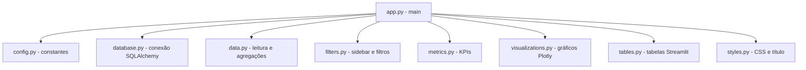
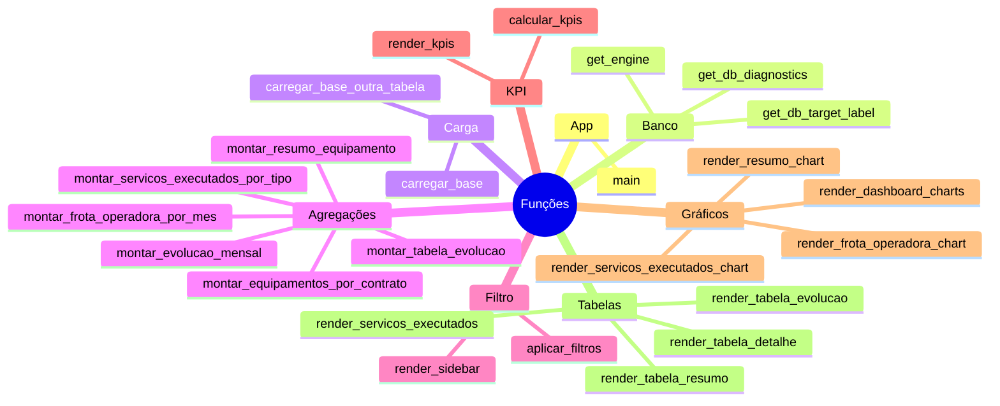

# Guia Passo a Passo do Código

Este documento explica, em linguagem prática, **como o dashboard funciona de ponta a ponta**, desde a inicialização até a renderização de gráficos e tabelas.

---

## 1) Visão geral rápida

O sistema é um dashboard em Streamlit que:
1. abre a página e aplica estilo;
2. busca dados no PostgreSQL;
3. monta filtros no sidebar;
4. transforma os dados para visão analítica;
5. renderiza telas diferentes conforme o menu selecionado.

---

## 2) Arquitetura em camadas



### Papel de cada módulo
- **`app.py`**: orquestrador principal.
- **`config.py`**: centraliza título, menu, queries e fallback de DB.
- **`database.py`**: decide origem da configuração (secrets/env/default) e cria engine.
- **`data.py`**: carrega base e cria agregações por equipamento/mês/contrato/serviço.
- **`filters.py`**: monta filtros de período, contrato, operadora e equipamento.
- **`metrics.py`**: calcula e exibe cards KPI.
- **`visualizations.py`**: gera gráficos por aba.
- **`tables.py`**: renderiza grids de dados.
- **`styles.py`**: personalização visual global.

---

## 3) Fluxo principal (função `main`)

```mermaid
flowchart TD
    A[Início main] --> B[set_page_config + aplicar_estilos_globais]
    B --> C{carregar_base OK?}
    C -- não --> D[Mostra erro + diagnóstico + stop]
    C -- sim --> E{df_base vazio?}
    E -- sim --> F[Aviso sem dados + stop]
    E -- não --> G[render_sidebar + aplicar_filtros]
    G --> H[montar agregações analíticas]
    H --> I[render_titulo_principal]
    I --> J{menu}
    J -->|Dashboard| K[calcular_kpis + render_kpis + gráficos principais]
    J -->|Resumo| L[gráfico resumo + tabela resumo]
    J -->|Wendells| M[gráfico frota por operadora]
    J -->|Serviços Executados - Teste| N[carrega 2ª base + gráfico + tabela]
    J -->|Tabela (fallback)| O[tabela evolução + tabela detalhe]
```

### Ordem real de execução
1. Configura página (`st.set_page_config`) e CSS global.
2. Tenta carregar a base principal (`carregar_base`).
3. Se der erro de conexão, mostra mensagem amigável + diagnóstico de secrets/env.
4. Se a base vier vazia, encerra com warning.
5. Renderiza sidebar e aplica filtros no DataFrame.
6. Pré-calcula estruturas derivadas:
   - resumo por equipamento;
   - equipamentos por contrato (mês mais recente);
   - evolução mensal;
   - evolução por mês/equipamento;
   - frota CCIT por operadora no mês mais recente.
7. Exibe título principal.
8. Roteia para a tela escolhida no menu.

---

## 4) Configuração e conexão com banco (passo a passo)

## 4.1 Prioridade de configuração de banco

O módulo `database.py` aplica uma hierarquia bem útil:

1. tenta `DATABASE_URL` (secrets e env);
2. se não existir, tenta parâmetros separados (`DB_HOST`, `DB_USER` etc.);
3. se ainda faltar, usa defaults de `DB_SETTINGS` do `config.py`.

Isso permite rodar localmente e também em cloud sem alterar código.

## 4.2 Normalização de URL

Se a URL vier como `postgres://...`, ela é convertida para `postgresql://...`, evitando incompatibilidade com SQLAlchemy moderno.

## 4.3 Diagnóstico operacional

Em caso de erro no carregamento inicial, `app.py` exibe:
- destino de conexão detectado (`get_db_target_label`);
- flags de diagnóstico (`get_db_diagnostics`) mostrando presença de secrets/env.

---

## 5) Pipeline de dados (módulo `data.py`)

## 5.1 `carregar_base()`

### Entrada
- consulta SQL `BASE_QUERY` (`base_historica_manutencao`).

### Transformações
- `data_ref` para datetime;
- `qtd`, `frota`, `percentual` para numérico (com `fillna(0)`);
- normalização de colunas textuais (`fillna('')`, `strip`).

### Saída
- DataFrame limpo para filtros e agregações.

## 5.2 `carregar_base_outra_tabela()`

### Entrada
- consulta SQL `BASE_QUERY_2` (`servicos_executados`).

### Regras
- valida colunas obrigatórias (`data_ref`, `qtd_servico`);
- converte tipos para datetime/numérico;
- retorna dataset pronto para aba de serviços.

## 5.3 Funções de agregação

### `montar_resumo_equipamento`
- agrupa por `equipamento`;
- soma `qtd` e `frota`;
- calcula média de `percentual`;
- recalcula `%` como `total_qtd / total_frota * 100`.

### `montar_evolucao_mensal`
- transforma `data_ref` em mês;
- agrega totais por mês;
- calcula `% qtd x frota` mensal.

### `montar_tabela_evolucao`
- semelhante à anterior, mas por `mes + equipamento`.

### `montar_equipamentos_por_contrato`
- identifica mês mais recente **de cada contrato**;
- agrega frota do mês mais recente;
- ordena e limita ao top 10.

### `montar_frota_operadora_por_mes`
- filtra somente equipamentos com `CCIT`;
- pega mês mais recente global no recorte;
- soma frota por operadora;
- mantém top 6;
- gera rótulo de mês abreviado em PT-BR (`jan/26`, etc.).

### `montar_servicos_executados_por_tipo`
- agrupa por `servico_executado`;
- soma `qtd_servico`;
- ordena desc para ranking.

---

## 6) Filtros e navegação (módulo `filters.py`)

## 6.1 Sidebar

Componentes:
- rádio de página (`MENU_ITEMS`);
- período (`date_input`) com faixa padrão de `01/01/2026` até hoje;
- multiselect de contrato, operadora e equipamento.

## 6.2 Aplicação dos filtros

`aplicar_filtros` executa em sequência:
1. filtro de período (intervalo ou dia único);
2. filtro por contratos selecionados;
3. filtro por operadoras selecionadas;
4. filtro por equipamentos selecionados.

> Importante: todos os filtros são cumulativos (AND lógico).

---

## 7) KPIs (módulo `metrics.py`)

## 7.1 `calcular_kpis`

Com base no `df_resumo` já agregado:
- média de entrada em manutenção (`media_percentual` médio);
- total de `qtd`;
- total de `frota`;
- `% geral` por razão `qtd/frota`;
- `mtbf_horas` fixo como "N/D" (placeholder).

Se vazio, retorna zeros e placeholder.

## 7.2 `render_kpis`

Renderiza 5 cartões:
1. Média Entrada em Manut.
2. MTBF (Horas)
3. Total QTD
4. Total Frota
5. % QTD x Frota

---

## 8) Visualizações (módulo `visualizations.py`)

## 8.1 Helpers de visual

- `_cor_texto_tema`: escolhe cor de texto conforme tema Streamlit.
- `_estilizar_figura`: padroniza fundo, grade, margens e legenda.
- `_mostrar_rotulos_barras`: força rótulos dentro das barras.

## 8.2 Tela Dashboard (`render_dashboard_charts`)

Organização em 2 linhas:
- **Linha 1**
  - `% QTD x FROTA` por mês;
  - `FROTA POR EQUIPAMENTO / MÊS` (agrupado por cor de equipamento).
- **Linha 2**
  - `SERVIÇOS EXECUTADOS` por mês;
  - `TOTAL PRINCIPAIS SERVIÇOS` (ranking horizontal por equipamento).
- **Bloco final**
  - `EQUIPAMENTOS POR CONTRATO - MÊS MAIS RECENTE`.

## 8.3 Outras telas

- `render_resumo_chart`: % por equipamento.
- `render_frota_operadora_chart`: ranking de frota CCIT por operadora no mês mais recente.
- `render_servicos_executados_chart`: ranking horizontal de serviços executados por tipo.

---

## 9) Tabelas (módulo `tables.py`)

- `render_tabela_resumo`: resumo por equipamento ordenado por %.
- `render_tabela_evolucao`: evolução por mês/equipamento.
- `render_tabela_detalhe`: base filtrada com `data_ref` formatada.
- `render_servicos_executados`: tabela detalhada da aba de serviços.

Todas usam `st.container(border=True)` e `st.dataframe(..., use_container_width=True)`.

---

## 10) Estilo e identidade visual (módulo `styles.py`)

`aplicar_estilos_globais` injeta CSS para:
- fundo e cor de texto do app;
- visual da sidebar;
- remoção de decoração padrão do header;
- espaçamento do container principal;
- cards customizados de título e KPIs.

`render_titulo_principal` imprime o título principal em bloco destacado.

---

## 11) Mapa de funções por responsabilidade



---

## 12) Checklist de entendimento do projeto (rápido)

Se você quiser explicar esse projeto para alguém em 1 minuto:

- O `app.py` centraliza o fluxo de execução.
- O `database.py` abstrai conexão e fallback de configuração.
- O `data.py` é o coração das transformações analíticas.
- O `filters.py` define o recorte de negócio.
- O `metrics.py` sintetiza números executivos.
- O `visualizations.py` traduz dados em leitura visual.
- O `tables.py` garante transparência dos dados por trás dos gráficos.
- O `styles.py` padroniza a experiência visual.

---

## 13) Próximos passos sugeridos (evolução)

1. Extrair textos/títulos dos gráficos para `config.py` (facilita manutenção).
2. Adicionar testes unitários nas funções de agregação (`data.py`).
3. Criar validação explícita de schema de entrada (colunas esperadas).
4. Parametrizar data padrão do filtro em config/env (hoje está fixa em 2026-01-01).
5. Incluir dicionário de dados (significado de cada coluna) para onboarding.

